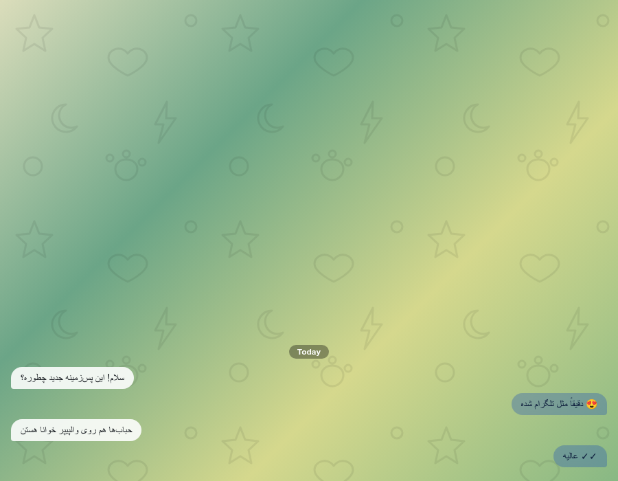

# Chat Bubbles — Telegram-style chat for Mattermost

A webapp-only Mattermost plugin that turns your channels and direct messages into a Telegram-style chat experience: message bubbles, floating hover actions, Telegram-style replies, forwarding, a pinned-message bar, a Telegram-Web-style unread badge on the browser tab, and more.

No server binary required — the plugin is pure JavaScript/CSS and works on Mattermost Web and Desktop.



## Features

- **Message bubbles** — your messages on the right, received messages on the left, with Telegram-style bubble tails on the last message of each group
- **Favicon unread badge** — when there are unread messages, the browser-tab icon becomes a red circle with the total count in white, exactly like Telegram Web (`99+` above 99); the original icon is restored once everything is read
- **Message font size** — optional fixed font size (10–28 px) for message text; code blocks and quotes scale along, Telegram-style
- **Responsive on mobile web** — wider bubbles and compact time chips on narrow screens, so text wraps normally in the phone browser
- **Telegram-style reply** — a non-editable preview bar above the message box; double-click any message to reply without opening the thread panel
- **Forward** — forward any message from the hover menu **or** the post `⋯` menu; Mattermost's own restricted "Forward message" dialog is replaced by the plugin's picker, so messages from private conversations can be forwarded anywhere too
- **Telegram-style forward picker** — destination list styled like the sidebar: profile pictures with online/away/DND status dots for people, icons for public/private channels and group messages, `@username` subtitles, live search (also by username), Enter to send to the first result
- **Toast notifications** — a confirmation toast ("Message forwarded to …") after a successful forward, a progress toast while attachments are re-uploaded, and an error toast if forwarding fails
- **Pinned message bar** — the latest pinned message in a bar at the top of the chat; click to jump, × to unpin
- **Time inside bubble** — send time in the bottom corner next to the read ticks
- **Floating date chip** — Today / Yesterday / date label while scrolling
- **Scroll-to-bottom button** — round button with a new-message counter
- **Message sounds** — subtle send/receive sounds in the open chat
- **Quote jump** — click a quote card to scroll to the original message in place
- Fully theme-aware (`auto` colors follow the active Mattermost theme, including dark themes)

## Installation

1. Download the latest `com.karman.chatbubbles-x.y.z.tar.gz` from the [Releases](../../releases) page (or build it yourself, see below).
2. In Mattermost, go to **System Console → Plugins → Plugin Management**.
3. Upload the `.tar.gz` file and **Enable** the plugin.
4. Ask users to refresh their Mattermost page.

> Uploading requires **Enable Plugin Uploads** (`PluginSettings.EnableUploads: true` in `config.json`).

## Settings

All settings live in **System Console → Plugins → Chat Bubbles**. After changing settings, users must refresh their page.

| Setting | Default | Description |
| --- | --- | --- |
| Enable chat bubbles | `true` | Master switch for the whole bubble mode |
| Only in DMs and group messages | `false` | Restrict bubbles to DMs/group messages (no channels) |
| My bubble color | `auto` | Your bubble color; `auto` follows the theme, or a hex like `#effdde` |
| Their bubble color | `auto` | Received bubble color |
| Bubble text color | `auto` | Text color inside bubbles |
| Max bubble width (%) | `70` | 30–95 |
| Hide my avatar | `true` | Hide the avatar on your own messages |
| Telegram-style reply | `true` | Reply preview bar above the message box |
| Time inside bubble | `true` | Send time in the bubble corner |
| Pinned message bar | `true` | Telegram-style pinned bar at the top |
| Floating date chip | `true` | Date label while scrolling |
| Scroll-to-bottom button | `true` | With new-message counter |
| Double-click to reply | `true` | Double-click a message to reply |
| Forward button | `true` | Forward with chat picker |
| Bubble tail | `true` | Telegram-style bubble tails |
| Message sounds | `true` | Send/receive sounds |
| Message font size (px) | `0` | 10–28; `0` keeps the theme default |
| Unread badge on browser tab | `true` | Telegram-Web-style red circle with the unread count on the favicon |

### Favicon badge notes

- The badge counts unread messages across all channels and teams; muted channels only contribute their mentions.
- To verify it quickly, run `cbTestBadge(5)` in the browser console — the tab icon should turn into a red `5` badge; `cbTestBadge(0)` restores it. A `[ChatBubbles] unread badge count:` line is also logged whenever the count changes.

## Building the bundle

The webapp bundle is plain, dependency-free JavaScript — there is no compile step. Packaging just stages the files into the layout Mattermost expects:

```bash
make dist
# → dist/com.karman.chatbubbles-<version>.tar.gz
```

Or manually:

```bash
mkdir -p build/com.karman.chatbubbles/webapp/dist
cp plugin.json build/com.karman.chatbubbles/
cp webapp/dist/main.js build/com.karman.chatbubbles/webapp/dist/
tar -C build -czf com.karman.chatbubbles-1.12.2.tar.gz com.karman.chatbubbles
```

## How it works

The plugin registers a webapp bundle that:

- injects a `<style>` element built from the admin settings (bubbles, tails, font size, etc.), keyed on Mattermost's own post classes — no DOM rewriting of message content;
- reads its settings from `/api/v4/config` (plugin settings are exposed to clients);
- adds small DOM widgets (reply bar, pinned bar, date chip, scroll button, forward picker, toasts) and event listeners for double-click reply and quote jumping;
- intercepts the native "Forward" menu item (and, as a fallback, the native "Forward message" dialog) and opens its own picker instead.

Because it is CSS-driven and webapp-only, it cannot break message data and can be disabled instantly from the System Console.

## Compatibility

- Mattermost Web and Desktop apps (the desktop app embeds the web client).
- Mobile apps are **not** affected (they don't load webapp plugins).
- Tested with recent Mattermost releases; selectors target the standard `post` DOM classes.

## License

[MIT](LICENSE)
